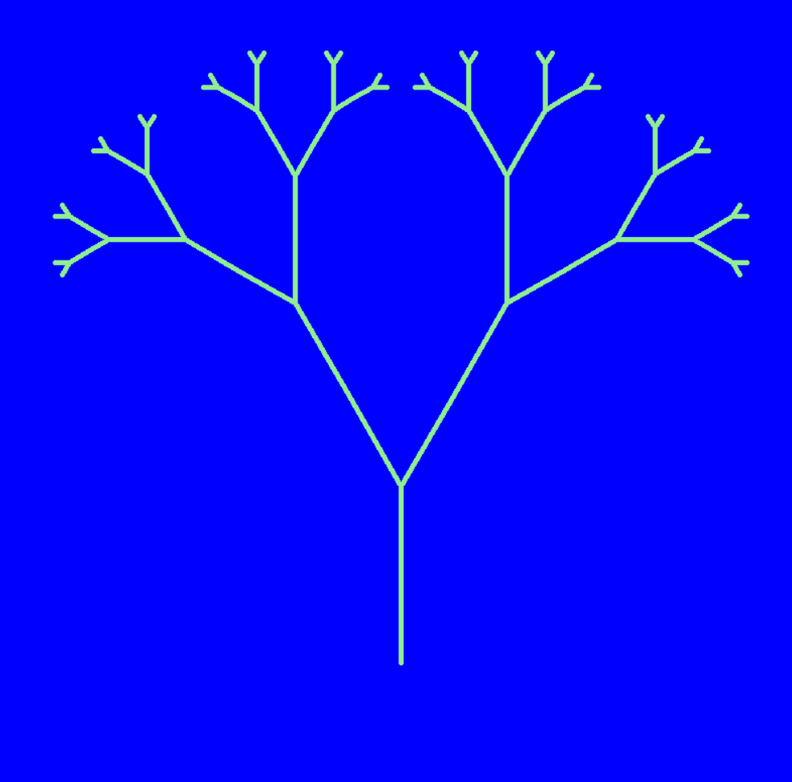

# Fractals

> Disclaimer: This exercise will provide some additional practice on using recursion by visualising fractals. We will be using the `turtle` library achieve this. How to use the `turtle` library is not part of the course material and will not be asked on the exam.

*A fractal is a never-ending pattern that looks similar no matter how much you zoom in or out. It’s created by repeating a simple shape over and over in smaller versions of itself. Think of a snowflake, a tree’s branches, or a lightning bolt—each part looks like a smaller copy of the whole. Fractals often appear in nature. Examples of this are fern leaves, trees, snowflakes etc.*

By using recursion, we can also create fractals programmatically. In this exercise we have provided some starter code already which uses the `turtle` library. This library enables you to draw lines on a blank sheet.

In the `starterscode.py`-file we have provided some starter code already to set up the drawing, by using turtle. The function `recursive_draw(tur, x, y, width, height, count)` will contain the logic to draw one piece of a fractal, and call upon itself to draw the smaller pieces attached to itself. Copy the content of this file to `student.py`

In the `example.py`-file we have provided a working example which visualises a [H-tree fractal](https://en.wikipedia.org/wiki/H_tree). Try to figure out how this example works and how it draws the different branches.

The next part of the assignment will be to draw a Y-tree fractal like shown below. Update `recursive_draw(tur, x, y, width, height, count)` to `recursive_draw(tur, x, y, length, angle, count)` and use the `length` and `angle` parameters to dynamically adjust your branches accordingly.

> Additional challenge: There are many more fractals we can visualise than the ones shown here. Search for interesting fractals you want to implement and adjust your code to visualise them.
